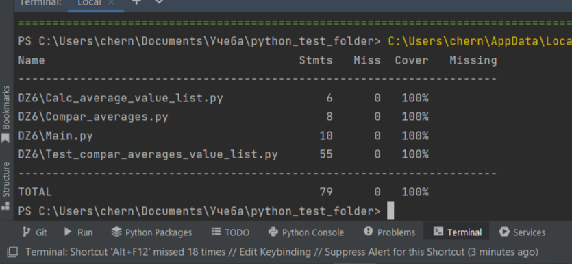

``Задание:`` 

Создайте программу на Python или Java, которая принимает два списка чисел и выполняет
следующие действия:

 a. Рассчитывает среднее значение каждого списка.

 b. Сравнивает эти средние значения и выводит соответствующее сообщение:
 - "Первый список имеет большее среднее значение", если среднее значение первого списка больше.
 - "Второй список имеет большее среднее значение", если среднее значение второго списка больше.
 - "Средние значения равны", если средние значения списков равны.

● Приложение должно быть написано в соответствии с принципами объектно-ориентированного
программирования.

● Используйте Pytest (для Python) или JUnit (для Java) для написания тестов, которые проверяют
правильность работы программы. Тесты должны учитывать различные сценарии использования вашего
приложения.

● Используйте pylint (для Python) или Checkstyle (для Java) для проверки качества кода.

● Сгенерируйте отчет о покрытии кода тестами. Ваша цель - достичь минимум 90% покрытия.

``Решение:``

1. В качестве языка программирования для выполнения проекта выбран Python. 
Приложение написано в соответствии с принципами объектно-ориентированного 
программирования. Код и тесты к нему представлены в папке `DZ6` по ссылке:

```https://github.com/Chernyimisha/python_test_cours.git```

2. Приложение реализовано тремя классами:

```Calc_average_value_list - класс, содержит статичный метод "calc_average" по поиску```
```среднего значения для списка чисел```

```Compar_averages - класс, содержит статичный метод "compare_averages" по сравнению средних```
```значений для двух списков, который генерирует сообщения о результате сравнения```

```Main - главный класс, выполняющий основную задачу приложения. В процессе инициализации```
```принимает в качестве атрибутов два аргумента в формате list. Содержит в себе метод```
```"print_result_message", при вызове которго в консоль выводится сообщение о результатах сравнения```
```входящих в класс атрибутов```

3. Тестирование кода приложения осуществлялось с помощью `pytest` и `unittest`. Для тестирования было выбрано
несколько сценариев:

```test_calc_average - юнит - тест по проверке правильности вычисления среднего значения для списка чисел```

```test_compar_averages - группа юнит - тестов, с помощью которых проверяется корректность сравнения средних значений```
```Применена група тестов, т.к. мной на момент реализации проекта не до конца уяснены вопросы захвата сообщений, выводимых методами в консоль,```
```а также параметризации тестов, неоходимых для реализации сценария в одном тесте```

```test_main_compar_averages - группа интеграционных (или сквозных) тестов, позволяющих проверить корректность сравнения двух списков```
```Применена група тестов, т.к. мной на момент реализации проекта не до конца уяснены вопросы захвата сообщений, выводимых методами в консоль,```
```а также параметризации тестов, неоходимых для реализации сценария в одном тесте```

```test_main_compar_type - юнит - тест на соответствие типов данных атрибутов класс Main типу list.```

```Тип данных проверяется только один раз, т.к. его проверка в других местах кода приложения не имеет смысла в виду того, что данные вводятся только в момент инициализации класса Main```

4. Результаты покрытия тестов:

